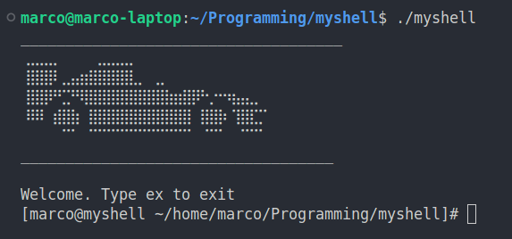

# myshell
Myshell is a custom linux shell written in C. It can execute standard commands and is designed to support custom built-in commands, which are not fully implemented yet.  
  
To support commands history and arrows navigations, this project uses [linenoise](https://github.com/antirez/linenoise)
Click [here](https://www.notion.so/myShell-294e266683b5806d9a95cfc18b091e47?source=copy_link) to consult notion page with todo list.